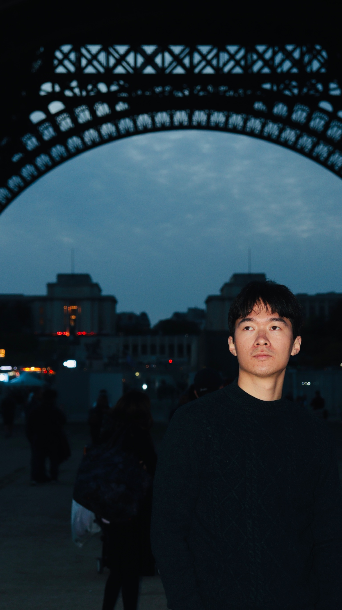

---
# Feel free to add content and custom Front Matter to this file.
# To modify the layout, see https://jekyllrb.com/docs/themes/#overriding-theme-defaults

layout: home
---

I am currently a first-year PhD student in Computer Science and Engineering in the Hong Kong University of Science and Technology. My supervisor is [Amir Goharshady](https://amir.goharshady.com). I am interested in the intersection of applied cryptography, blockchains, security & privacy, algorithms, game theory and formal verification. 

Before starting PhD, I was a MPhil in the same group during 2021~2023. Before coming to HKUST, I received my Bechalor's degree in Automation from Tsinghua University in 2021. 

<figure>
    
</figure>

# Publication 

Check my [Google scholar profile](https://scholar.google.com/citations?user=1rGe9XMAAAAJ&hl=en). 

## 2023

<ul>
    <li>
        
(ICBC'2023) Trustless and bias-resistant game-theoretic distributed randomness. 

    </li>
    <li>
        
(MARBLE'2023) Game-theoretic Randomness for Proof-of-Stake. 

    </li>
    <li>
        
(OOPSLA'2023) Asparagus: Automated Synthesis of Parametric Gas Upper-Bounds for Smart Contracts. 

    </li>
    <li>
        
(IEEE Blockchain'2023) PureLottery: Fair Leader Election Without Decentralized Random Number Generation. 

    </li>
</ul>

## 2021

<ul>
    <li>
        
(ACL'2021) <a href="https://aclanthology.org/2021.acl-short.90" > Towards Visual Question Answering on Pathology Images</a>. 

        <iframe src="https://aclanthology.org/2021.acl-short.90/" style="height:200px; width:500px"></iframe>
    </li>
    
</ul>

